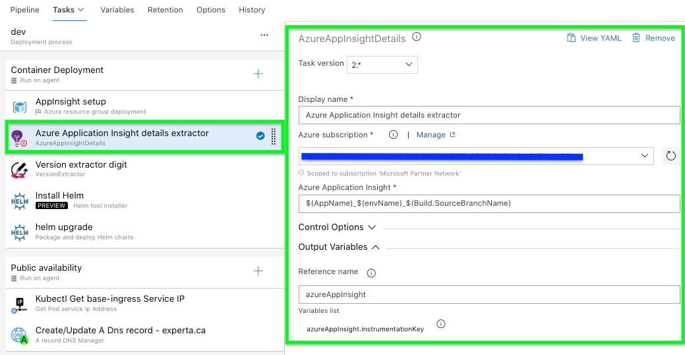

# Purpose & description
This is our current customs Azure DevOps tasks toolbox. Theses tasks has been specifially created for our needs and why not shared it for the entire community.
Eventually, we will publish each of these tasks separately.
If you have any comment/suggestion, please feel free to share it with us.

# Tasks include

## VersionExtractor

#### Output variables
- versionMajor
- versionMinor
- versionPatch
- revisionNumber
- fullVersion
#### Important
*** Build name require to have v0.0.0 format ***

## ACRCredentials

#### Action Type
- Show: Get the current credentials information
- Renew: Renew the current credentials information access
#### Output variables
- username
- password
- password2

## ACRAKSAccess


## AzureAppInsight

#### Output variables
- instrumentationKey

## FileContentToBase64

#### Output variables
- base64Content

## ManageKeyVaultSecrets

#### Secrets file path (expected file format content)
```json
[
	{
		"secret": "my_first_secret",
		"value": "my_first_secret_value"
	},
	{
		"secret": "my_second_secret",
		"value": "my_second_secret_value"
	}
]
```
#### Important
*** Ensure that your subscription service principal have proper access policies rights on your Azure Key Vault ***

## ManageKeyVaultSingleSecret

#### Important
*** Ensure that your subscription service principal have proper access policies rights on your Azure Key Vault ***